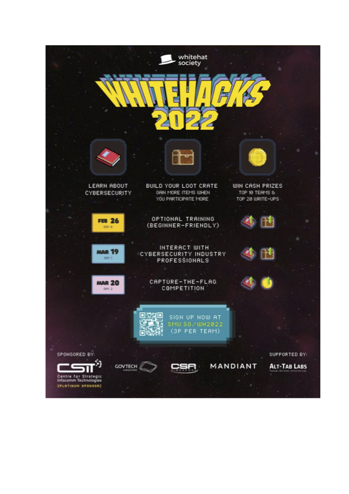
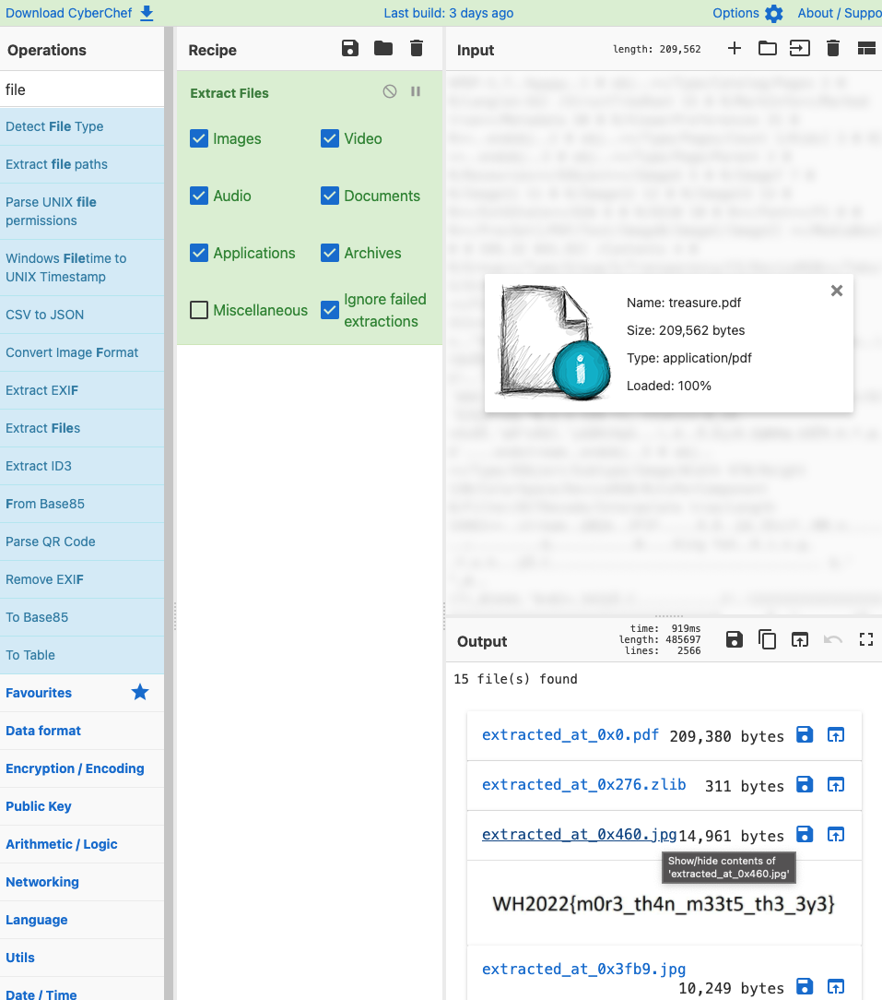

# CTF.SG CTF 2022 | Garbage Runner
## The contestant is given a .pdf file named __treasure.pdf__. It seems to just be a promotional poster for the competition, but it appears to be hiding something.
---
>It was an unexpectedly easy grab, and it helped my team gain about 700 points right before the competition ended.
* Look at the PDF
  * Why is it in a PDF format? Why is there a white border?
  
  > This is just a .png coversion of the PDF.
* Extract files from PDF file
  * I suddenly had the idea of extracting files from it, and opened it in [Cyberchef](https://gchq.github.io/CyberChef/).
  > When you look for hidden files in Cyberchef, you want to go through files other than .zlib ones (they seem to be nonsense data) that also have a substantial size (at least 1000 bytes or so).
  
  
**WH2022{m0r3_th4n_m33t5_th3_3y3}**