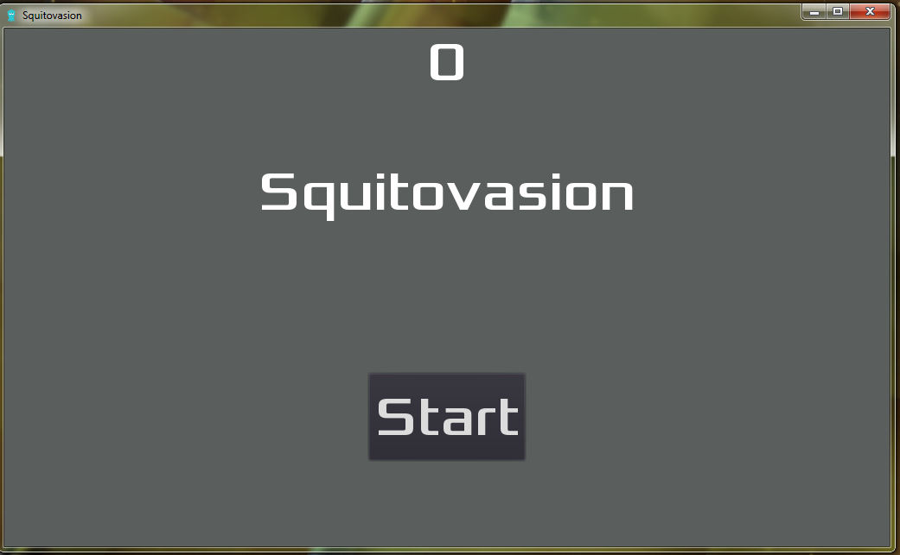
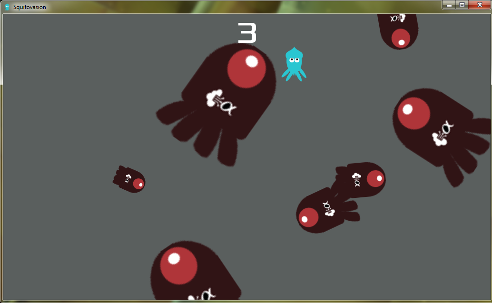
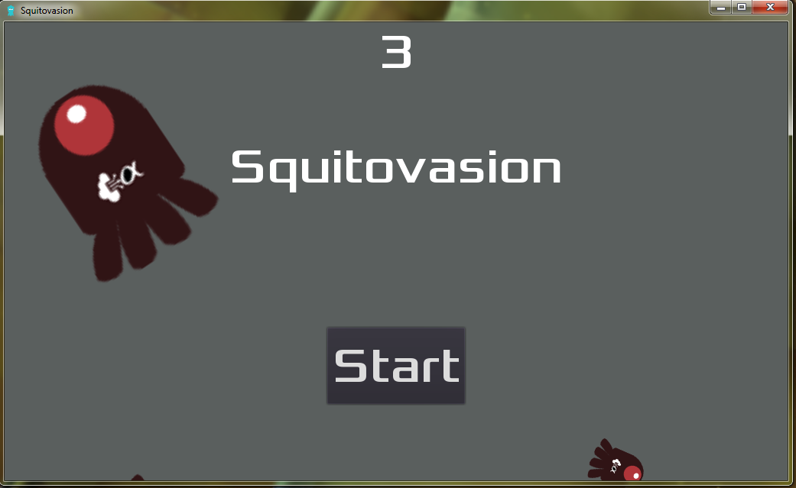

# Whitehacks 2022 | Squitovasion
## The contestant is given a Windows executable named __squitovasion.exe__. It is a simple video game created into the game engine Godot that involves the player (a squid) avoiding enemies (alpha particles) with the 4 arrow keys, while a MIDI-sounding rendition of the folk song Chan Mali Chan plays in the background.
---
>I love how I got to use Cheat Engine in a CTF challenge.
* Playing the game
  * I had to run the game in a virtual machine due to me not natively running Windows.
  * The game itself is very simple:
  
  
  
    >Take note of how there is a stopwatch at the top of the screen. Maybe the objective of the game is to survive for as long as possible?

    >Also, the game flashes "Game over" before transitioning into the start menu again.
* Cheating the game
  * Thankfully, it was very simple: find and change an integer value.
  Cheat Engine was the perfect job for the tool.
    > 1. Launch and start game
    > 2. Select "New Scan", with scan type set to "Exact Value" and value set to 0, precisely when the stopwatch only displays "0". We want to search for the memory address that holds the time elapsed shown in the stopwatch.
    > 3. Refine the search by changing the value to an integer __n__, and selecting "Next Scan" exactly when the stopwatch hits __n__. (You are going to have to play the game for a few seconds for this.) For convienience, tick "Pause the game while scanning". This is going to require you to have good reflexes.
    > 4. Once you have narrowed the search down to a few addresses, play the game normally, and see which address holds a value that corresponds to whatever is being shown on the stopwatch. Double click it and save it.
    > 5. Play the game again and change the value of that address to a large number, while not overflowing it.
    
    This is the result:
  
  **WH2022{One_D0es_NoT_S1mply_RE_5Qu1t0}**